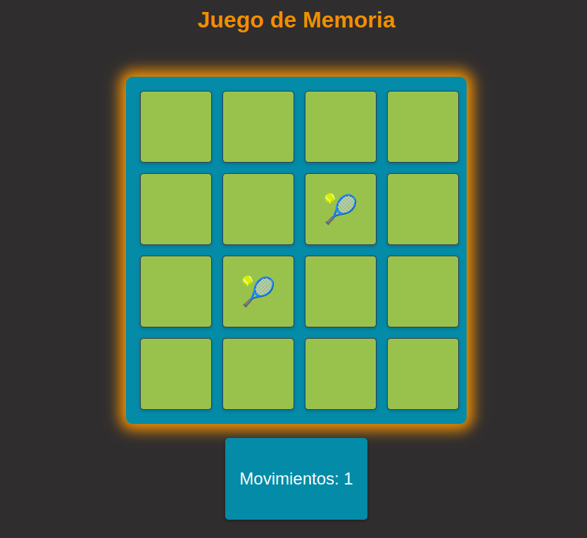

# Juego de Memoria



Juego de memoria desarrollado en JavaScript utilizando HTML y CSS para la interfaz. El objetivo del juego es encontrar las parejas de cartas en el menor tiempo posible.

## Características

- Tablero de 4x4 con 8 parejas de cartas.
- Barajado aleatorio de las cartas al iniciar el juego.
- Sistema de coincidencias para verificar si dos cartas seleccionadas son iguales.
- Temporizador para medir el tiempo que tarda el jugador en completar el juego.
- Contador de intentos.

## Tecnologías Utilizadas

- **HTML**: Estructura del tablero y las cartas.
- **CSS**: Estilos y animaciones.
- **JavaScript**: Lógica del juego, manejo de eventos y temporizador.

## Estructura del Proyecto

```sh
.
├── css
│   └── styles.css
├── index.html
└── js
    └── script.js
```

## Instalación y Uso

1. Clonar el repositorio:

   ```bash
   git clone https://github.com/usuario/memory-game.git
   ```

2. Abrir `index.html` en un navegador web.
